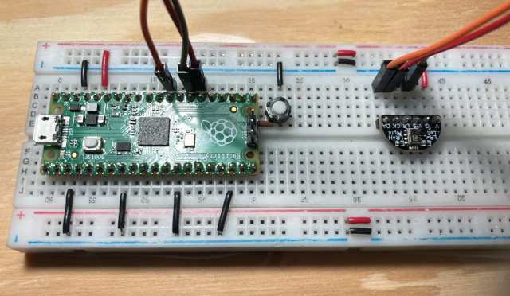

# pico-i2s-mic
Record audio on the Respberry Pi Pico from an I2S microphone

This is a simple example that uses the Raspberry Pi Pico to record data from an I2S microphone (`MSM261S4030H0`) using the PIO with DMA and IRQ.

The connections from the Pico to the microphone board are:

| Pico GPIO  | Microphone board pin | Direction | Meaning                             |
|------------|----------------------|-----------|-------------------------------------|
| 20         | CK                   | to mic    | I2S clock                           |
| 21         | WS                   | to mic    | word select (0=left/1=right sample) |
| 22         | DA                   | to pico   | data bit from microphone            |

This demo uses the PIO to continually read 24-bit samples from the microphone at 24kHz (this microphone is sensitive up to about 10kHz, so sampling too far above 20kHz is useless) and prints samples to the serial output.

Since we're using only one microphone, only the left channel is available (the LR microphone pin is grounded to make the microphone to output the data on the left I2S channel). This code works just as well with two microphones:
- the 3 pins (CK, WD, DA) of both microphones should be tied together and to the corresponding pins on the Pico
- one of the microphones should have LR grounded (left channel), and the other one should have LR tied to +3.3V (right channel)

The code supports manual reading from the PIO (without DMA/IRQ) or double-buffered asynchronous reading with DMA and an IRQ to swap the buffers at the appropriate time.
